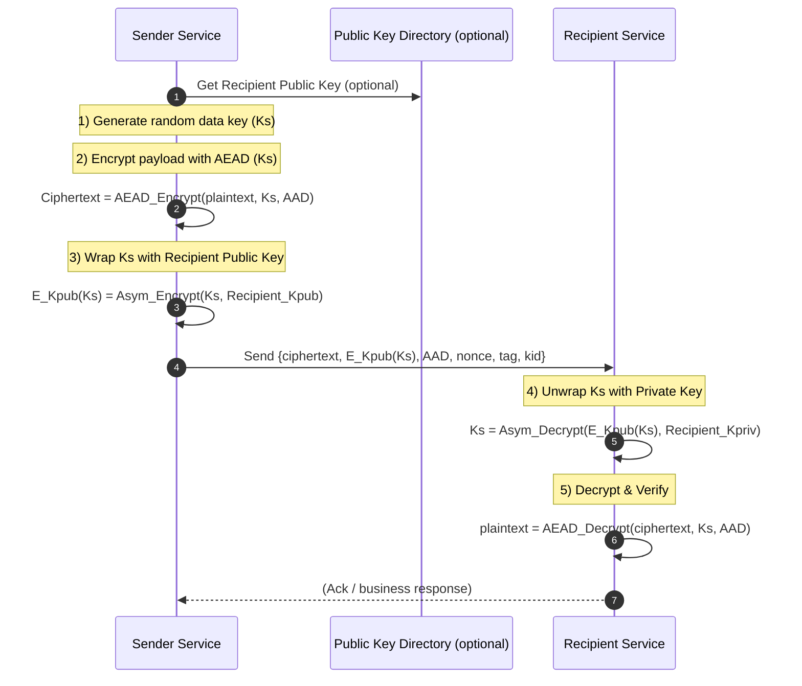

# Inter‑Service Encryption: Hybrid (Envelope) Approach — Platform‑Agnostic Guide

This short guide explains how to protect **service‑to‑service** communication at the **application layer** using a **hybrid (envelope) encryption** pattern — **without** assuming any specific cloud/provider.

---

## Why Hybrid?
- **Asymmetric crypto** (public/private keys) is great for **key distribution** and **identity** (you can share public keys widely; private keys stay secret).
- **Symmetric crypto** (shared secret) is fast and ideal for **bulk data encryption**.
- **Hybrid / envelope encryption** combines the two:
  1) Generate a fresh **random data key** (symmetric) per message/batch.
  2) Encrypt the payload with the data key using an **AEAD** cipher (e.g., AES‑GCM, ChaCha20‑Poly1305) to get confidentiality **and** integrity.
  3) **Wrap** (encrypt) the data key with the **recipient’s public key**.
  4) Send `{ciphertext, encrypted_data_key, aad/metadata}` to the recipient.
  5) Recipient **unwraps** the data key with its **private key** and decrypts the payload.

> Result: Only the intended recipient can recover the data key; payload remains unreadable even if the network is observed.

---

## Roles & Responsibilities
- **Sender service**: Creates plaintext payload; generates random **data key**; encrypts payload (AEAD); **wraps** the data key with recipient’s **public key**; sends the bundle.
- **Recipient service**: Uses its **private key** to **unwrap** the data key; decrypts payload; validates AEAD integrity and **Associated Data (AAD)**.
- **Key directory / PKI** (optional but recommended): Publishes **public keys** of services; **never** distributes private keys.

> **Private keys are never shared.** Public keys may be distributed via a directory, PKI, or signed key set.

---

## Rotation & Lifetimes
- **Data keys**: Rotate **per message** or **per small batch** (cheap and automatic in this pattern).
- **Key pairs** (public/private): Rotate on a schedule; publish the **new public key**; begin wrapping with the **new public key** while accepting unwraps with the **old private key** during a grace window.
- Maintain **key identifiers (kid)** in messages so recipients know which key to use.

---

## Integrity & Context Binding (AEAD AAD)
Include **Associated Data (AAD)** that is **not encrypted** but **is authenticated**. Examples:
- `tenantId`, `senderService`, `recipientService`, `messageId`, `timestamp`, `contentType`
If any of these are tampered, AEAD decryption **fails**.

---

## Minimal Message Format
```json
{
  "alg": "AES-GCM",
  "kid": "recipient-key-v3",
  "aad": { 
    "tenantId": "t-42", 
    "sender": "orders", 
    "recipient": "billing", 
    "msgId": "9f2c..." 
  },
  "ciphertext": "<base64>",
  "encrypted_data_key": "<base64 of RSA/ECDH-wrapped key>",
  "nonce": "<base64>",
  "tag": "<base64>"
}
```
**Note**: The `tag` field may be separate or embedded in the ciphertext depending on AEAD implementation.

---

## Mermaid Diagram — Envelope Encryption Flow



---

## Guardrails & Practices
- Use **mTLS** for transport + **AEAD** at application layer for defense-in-depth.
- Store private keys in a **hardware‑backed** keystore/HSM where possible.
- Pin **algorithms** to modern choices (AES‑GCM or ChaCha20‑Poly1305; RSA‑OAEP or ECDH‑ES) and document minimum key sizes.
- Add **rate limits/alerts** on decryption failures (possible tampering or replay).
- Log **key IDs** (not raw keys) for auditing; avoid logging secrets.

---

## One‑Minute Summary (for interviews)
- Choose **hybrid/envelope encryption** for inter‑service payload privacy.
- **Symmetric** key encrypts the data (fast, AEAD provides integrity).
- **Asymmetric** key wraps the symmetric key (safe distribution, no private‑key sharing).
- Rotate **data keys** per message; rotate **key pairs** on schedule; include **kid** and **AAD** for safe, contextual decryption.